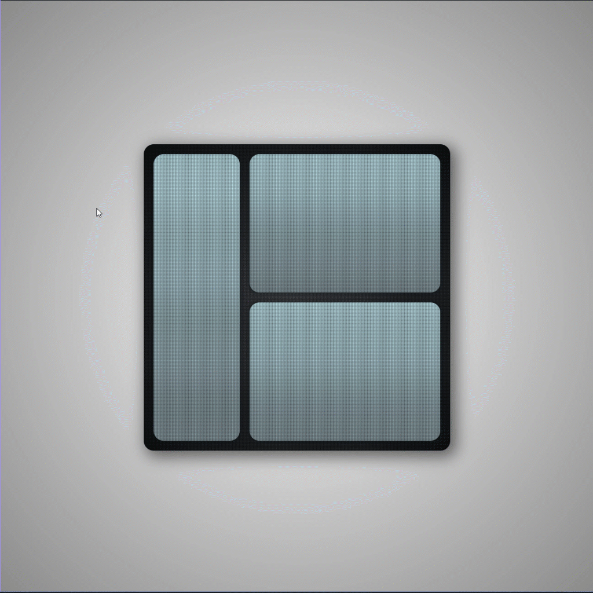

# Daily Design 08 - CSS hover and transitions

[](https://www.youtube.com/digitalclay)
[](https://twitter.com/3DRudy)
[](https://github.com/RuDeeVelops/creativedev-log/commits/main)

### Tech stack: `css` `html`

### Live link: https://codepen.io/3DRudy/pen/RwdEQEZ

<br>

<p align="center">
    
</p>

### Main idea

- An elegant `:hover` effect is created by playing with a few animations layered on top of each other.
- Backgrounds are designed by layering `background-color`, a `radial-gradient` and a SVG pattern within `background-image`.
- We transition into a sutbly different `background-color` and `background-image`.
- A `blur-effect`, `outline-effect` and `glow-effect` are stacked to obtain smooth motion.
  - `blur-effect` plays once
  - `outline-effect` plays once and doesn't revert (`forwards`)
  - `glow-effect` loops infinitely
- All the action happens here:

<div style="max-width: 70vw; margin-left: auto; margin-right: auto;">

```css
.left-container:hover,
.mini-container:hover {
  cursor: pointer;
  background-color: #2c2c2e;
  background-image: radial-gradient(circle, #eef2f3, #33393d),
    url("data:image/svg+xml,%3Csvg xmlns='http://www.w3.org/2000/svg' width='2' height='2' viewBox='0 0 100 100'%3E%3Cg fill='%33393d' fill-opacity='0.5'%3E%3Cpath d='M0 0h50v50H0zm50 50h50v50H50zM50 0h50v50H50zm0 50h50v50H50z'/%3E%3C/g%3E%3C/svg%3E");
  background-blend-mode: overlay;
  transition: background-color 0.3s ease-in-out, background-image 0.3s
      ease-in-out;
  animation: blur-effect 0.4s cubic-bezier(0.075, 0.82, 0.165, 1), outline-effect
      0.4s cubic-bezier(0.075, 0.82, 0.165, 1) forwards,
    glow-effect 1s cubic-bezier(0.075, 0.82, 0.165, 1) infinite;
}
```

</div>
